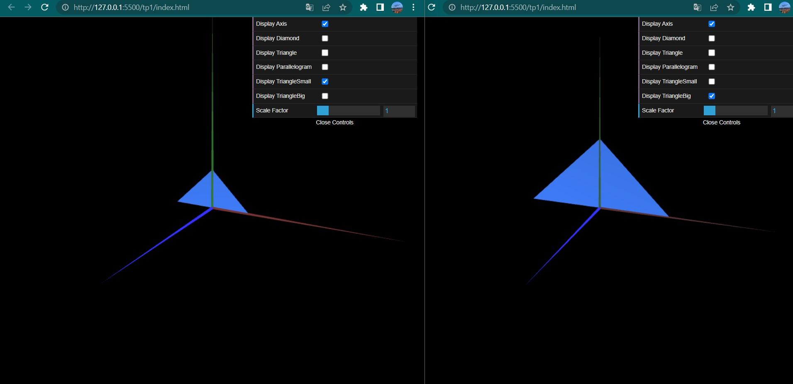

# CG 2022/2023

## Group T08G12

## TP 1 Notes

-I managed to represent the two requested figures without any major issue. I left the comments of the base code untouched as they helped me getting familiar with the concepts.

