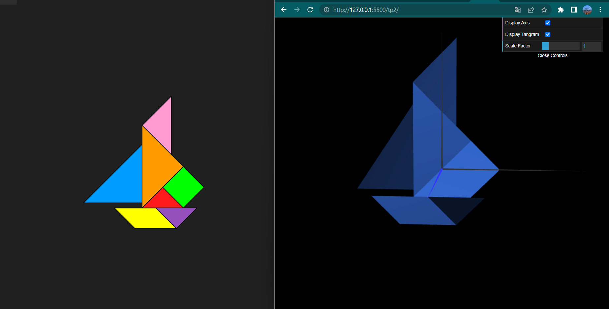
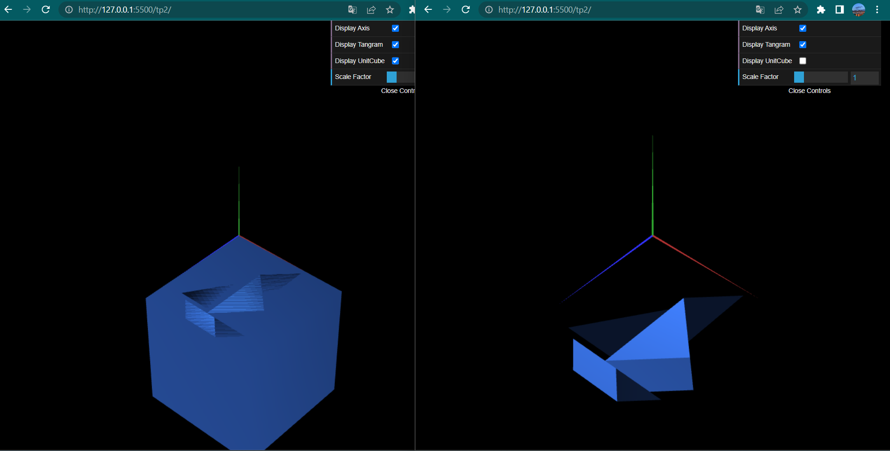
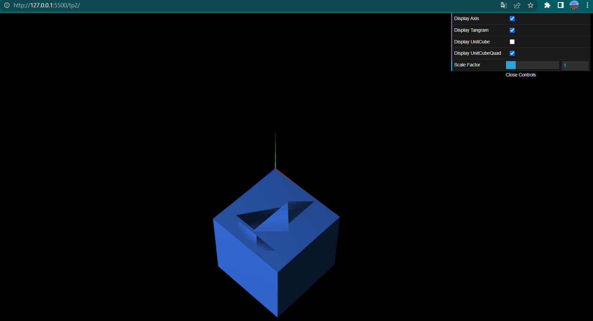

# CG 2022/2023

## Group T08G12

## TP 2 Notes

-I still don't know how to use lights so the illumination is random

;

-I took a screenshot showing both the result with the cube behind the tangram image and without because the tangram on top of the cube is not fully visible
-The upper left vertex of the cube is approximately in the origin, but probably not 100% coincident

;

-Creating the cube using the MyQuad class I notice that the resulting illumination is different. The faces of the cube are better defined and more visible, and unlike in the first cube, each face if observed from a specific point of view receives light.

;