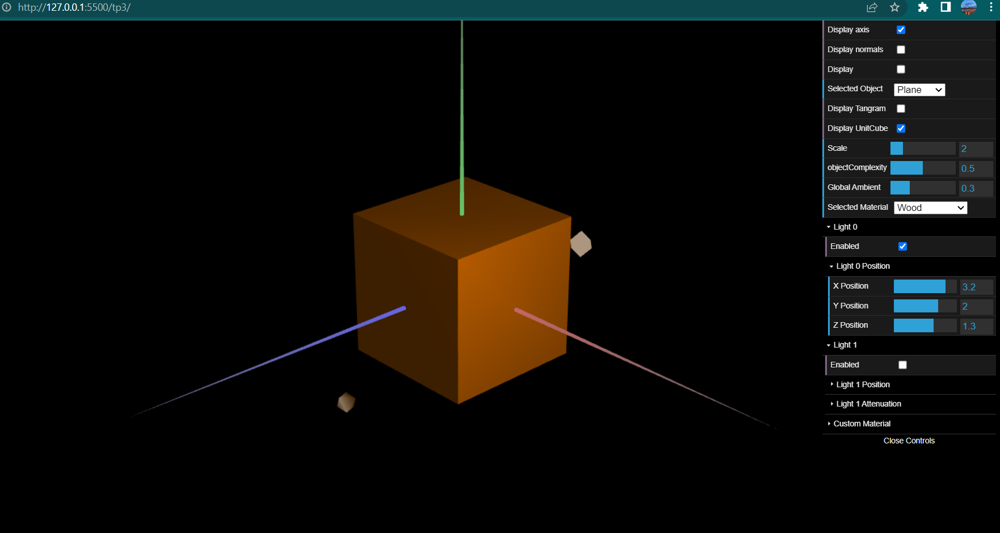
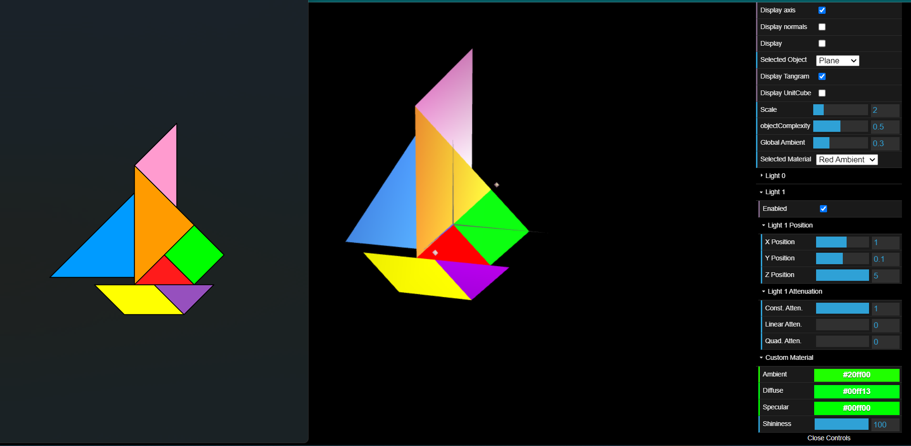

# CG 2022/2023

## Group T08G12

## TP 3 Notes

-I have defined the requested normals for all the vertices of the objects. I haven't managed yet to find an efficient way to define needed vectors in the MyUnitCube initBuffers function, so I wrote their values manually.

-I have managed to create and apply without problems the "wooden" color to the cube ad requested

;

-I've created the needed materials to correctly represent the MyTangram's objects colors and inserted them in a new "initMaterials" method defined in the MyTangram class and initialized in its constructor.
I've had some issues understanding where to call each material but that was solved once I realized for each part of the tangram only the last material applied would be visible, therefore each one had to be called right before the respective object's call to be displayed.
I then applied the "custom" material only to the diamond contained in the tangram.

;
