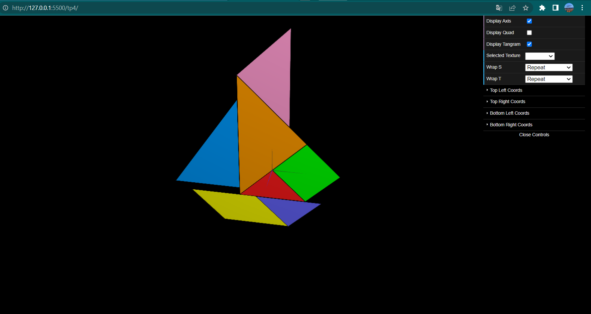
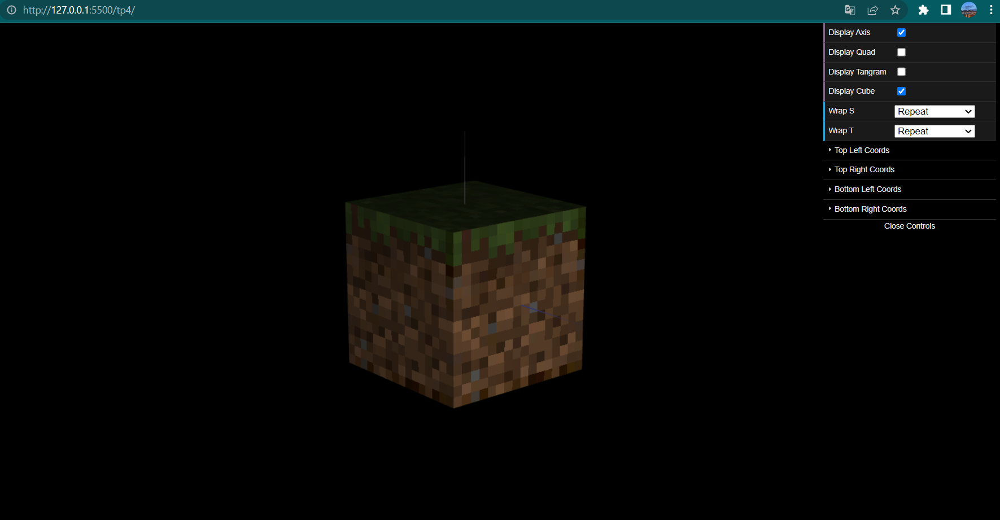

# CG 2022/2023

## Group T08G12

## TP 4 Notes

-I have applied the indicated texture using different texCoords for each object used in the creation of the Tangram. I am not sure if the new material had to be created inside of MyScene or in MyTangram, I chose the first one.

;

-I have applied the requested textures to the six faces of the cube and changed the type of filtering to make them look more defined.
 
;
