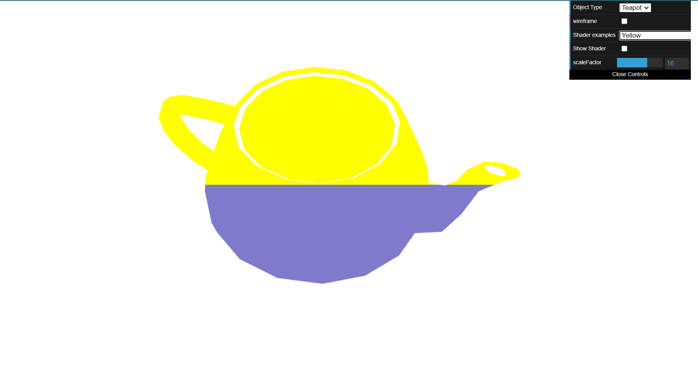
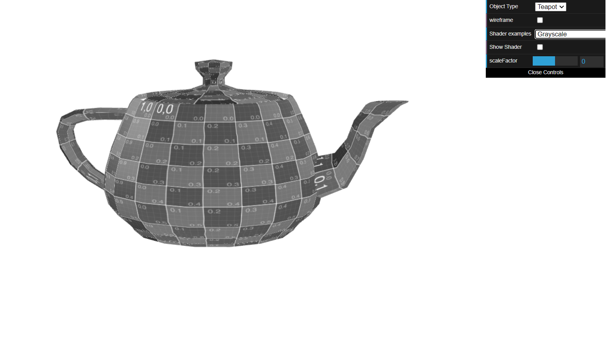
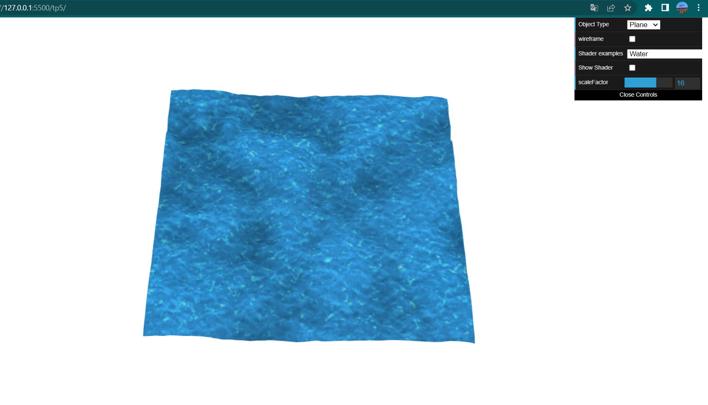

# CG 2022/2023

## Group T08G12

## TP 5 Notes

-I created new vertex shaders in order to color the teapot as requested: yellow in the upper half and blue in the lower one according to the position of the fragments in the window

;

-I created a fragment shader called grayscale to make the teapot appear gray. I also included a video of the gray teapot moving on the XX axis to prove the previous goal has been achieved.

;
;

-I've created the two new shaders based on the texture2 ones, replaced the in-scene textures with the water ones and tried to satisfy the requests. Using the waterMap as a heightmap was quite simple. On the other hand I had some issues trying to understand how to make the animation and the fragment colors appear the right way. I've obtained some very approximate results: the colors and shading of the water look right but I feel there's still some problem with the texture coordinates since you can see the line that divides the different repetions of the texture.

;

